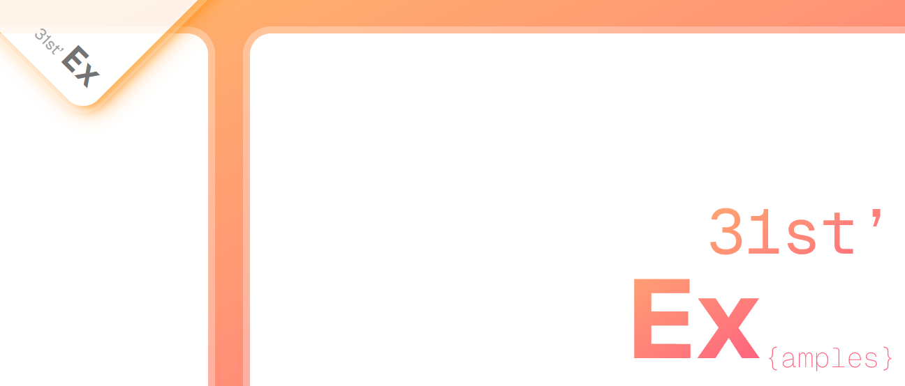

# 31st ex(amples)



This project/repository is a collection of code examples related to the [31st.fr](https://31st.fr) website's blog. Feel free to clone it and use it for your own projects or just for learning, testing or whatever you want.

## Usage

Clone the repo and run the following commands:

Install dependencies:

```bash
yarn install
# ...or
npm install
```

Run the app in development mode:

```bash
# Development mode
yarn dev
# ...or
npm run dev
```

Run the app in production mode:

```bash
# Production mode
yarn build && yarn start
# ...or
npm run build && npm run start
```

## Credits

This repository was created by [31st.fr](https://31st.fr)

## License

This project is licensed under the terms of the [MIT license](LICENSE)
